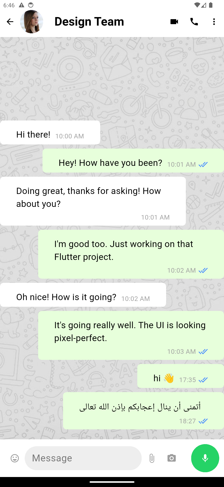

# Zytronic Flutter Assessment – Documentation

## 📝 Description

This app is a clone of the WhatsApp app. It has the same UI and functionality as the original app, but it is written in Flutter.

### Sammary

Using Flutter and Firebase build a clone of the WhatsApp app.

- home page of whatsapp ui
- chat page of whatsapp ui
- stories page of whatsapp ui
- simulation of messaging between users
- simulation of Navigation between pages
- Using mocks stories data and messages data to taste the app
- Applying Clean Architecture.
- Using Firebase to store data.
- Using ScreenUtil to handle responsive UI.
- Using Google Fonts to handle fonts.

---

## Project Architecture

```bash
lib/
├── core/
│   ├── config/
│   │   ├── themes/
│   ├── helpers/
├── features/
│   ├── chats/
│   │   ├── data/
│   │   │   ├── models/
│   │   │   ├── repositories/
│   │   ├── presentation/
│   │   │   ├── pages/
│   │   │   │   ├── chat_screen.dart
│   │   │   ├── widgets/
│   │   │   │   ├── building_massage.dart
├── shared/
│   ├── widgets/
│   │   ├── whats_app.dart
│   ├── services/
│   │   ├── firebase_options.dart
├── main.dart
```

## 🎥 Demo Video

 [Video](https://drive.google.com/file/d/1GD_cKeyL92bqKQ143kJ9GKmKRADIUZnE/view?usp=sharing).

---

## Demo App

[App](https://appetize.io/app/b_mwu46cgqypjsfvp3uafeac7rd4).

---

## ScreenShots

<p float="left">
 
  
  
  

</p>

## 1. Design Decisions

- **UI Consistency:** Carefully matched the WhatsApp design (colors, fonts, icons, and spacing) to ensure pixel-perfect accuracy.
- **Theme Support:** Implemented both light and dark modes to enhance usability and provide a modern user experience.
- **Responsive Layout:** Used `ScreenUtils` and `Flexible/Expanded` widgets to ensure the app adapts to different screen sizes.

---

## 2. Best Practices

- **Clean Architecture:** Code organized by features (`home`, `chat`, `stories`) with separate `widgets` folders for reusability.

- **Separation of Concerns:** UI, logic, and theme separated to make the project scalable.

---

## 4. Quality Assurance

- Tested on multiple device sizes and orientations.
- Verified both light and dark themes.
- Ensured smooth navigation and animations.

---

## 5. How to Run

```bash
   git clone "https://github.com/elsaramji/zytronic_whatsapp_clone.git"
   cd zytronic_whatsapp_clone
   flutter pub get
   flutter run
```

---

**Author:** Mahmoud El-Saramji.