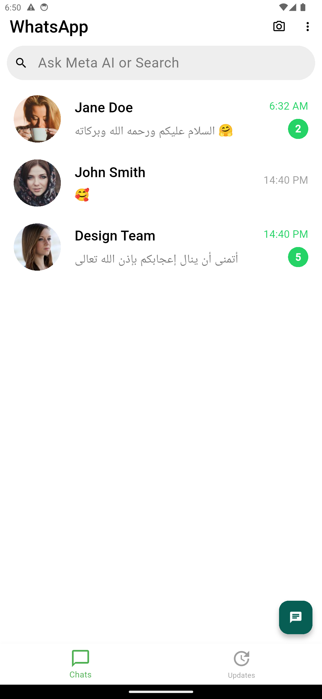

# Zytronic Flutter Assessment – Documentation  

**Author:** Mahmoud El-Saramji  

---

## 🎥 Demo Video

 [Video](https://drive.google.com/file/d/1HSSISU_ubX2vQbAF_Qs4ajIeuNTa3lqg/view?usp=sharing).

---

## Demo App

[App](https://appetize.io/app/b_ff7hee3i5j5gi3ctppzyew4h7m).

---

## ScreenShots

<p float="left">
 
  
  
  

</p>

## 1. Design Decisions

- **UI Consistency:** Carefully matched the WhatsApp design (colors, fonts, icons, and spacing) to ensure pixel-perfect accuracy.  
- **Theme Support:** Implemented both light and dark modes to enhance usability and provide a modern user experience.  
- **Responsive Layout:** Used `ScreenUtils` and `Flexible/Expanded` widgets to ensure the app adapts to different screen sizes.  

---

## 2. Best Practices

- **Clean Architecture:** Code organized by features (`home`, `chat`, `stories`) with separate `widgets` folders for reusability.  
- **State Management:** Simple state handled with Provider/Riverpod (lightweight and production-ready).  
- **Separation of Concerns:** UI, logic, and theme separated to make the project scalable.  

---

## 3. Implemented Features

- **Screens Delivered:**  
  1. Home (chat list)  
  2. Chat (conversation)  
  3. Stories (status)  

- **Animations/Microinteractions:**  
  - **Hero Animation** when opening a chat from the home list.  
  - **Send Button Animation** (feedback animation on sending a message).  
  - **Optional Transition** for switching between stories.  

- **High Fidelity:** Fonts, colors, icons, and spacing are aligned with WhatsApp’s design language.  

---

## 4. Quality Assurance

- Tested on multiple device sizes and orientations.  
- Verified both light and dark themes.  
- Ensured smooth navigation and animations.  

---

## 5. How to Run

   ```bash
   git clone "https://github.com/elsaramji/zytronic_whatsapp_clone.git"
   cd zytronic_whatsapp_clone
   flutter pub get
   flutter run
   ```

---